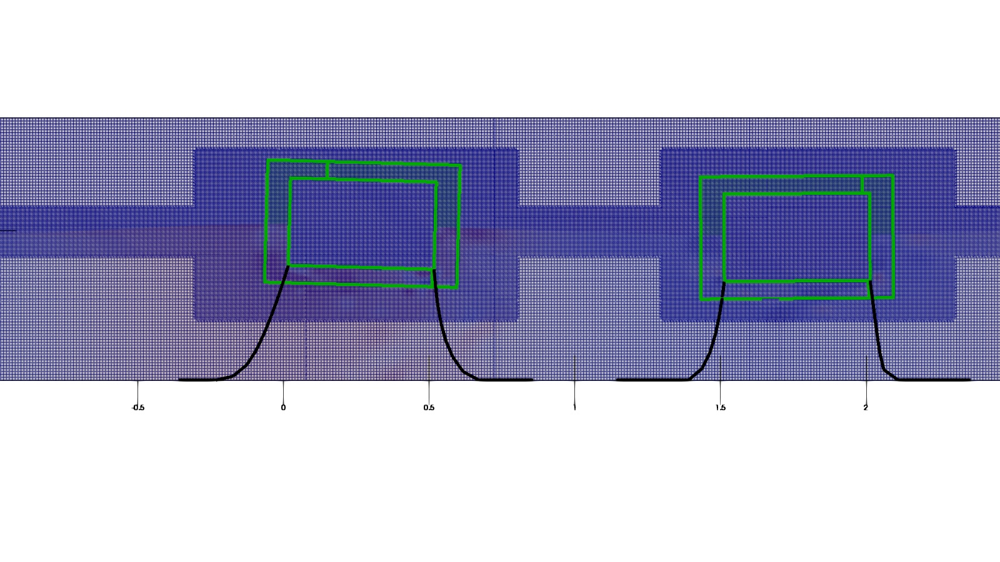
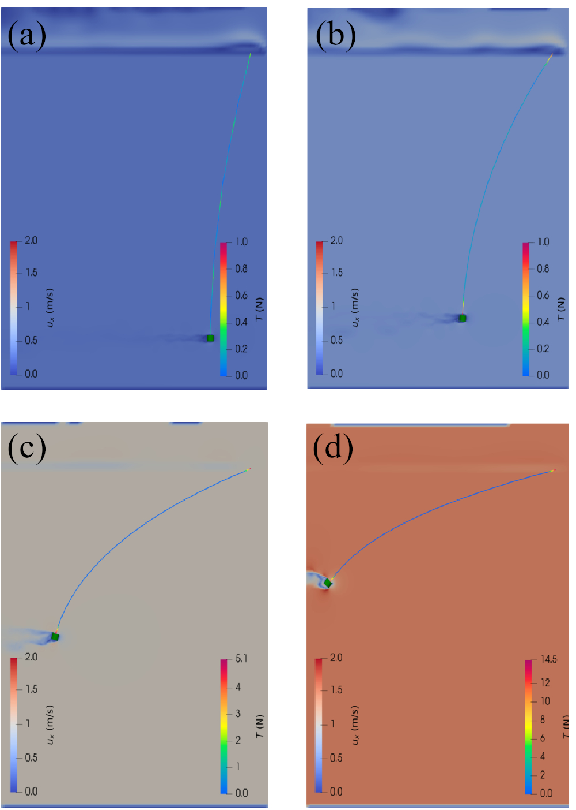

Dynamic mooring restraints for rigid body motion in OpenFOAM

<!--
<iframe width="560" height="315" src="https://www.youtube.com/embed/nKYjpl760iU?si=-2vMFo7eMvSuQZnF" title="twinFB shared mooring" frameborder="0" allow="accelerometer; autoplay; clipboard-write; encrypted-media; gyroscope; picture-in-picture; web-share" allowfullscreen></iframe>

<iframe width="560" height="315" src="https://www.youtube.com/embed/kJBZbLkTV_s?si=5nni3-Krf1H5YigY" title="overset 3d" frameborder="0" allow="accelerometer; autoplay; clipboard-write; encrypted-media; gyroscope; picture-in-picture; web-share" allowfullscreen></iframe>

## drive
<iframe width="560" height="315" src="https://drive.google.com/file/d/1qwFgW-DSzC8BF5sjAJmnyXOt2R_NYqrP/preview" frameborder="0" allow="autoplay; encrypted-media" allowfullscreen=""></iframe>

<iframe width="560" height="315" src="https://drive.google.com/file/d/1IFdAIhLqr1UfWFitjN71iEVceWMF4Qho/preview?usp=sharing" frameborder="0" allow="autoplay; encrypted-media" allowfullscreen=""></iframe>

<iframe width="560" height="315" src="https://drive.google.com/file/d/1BkfDo1TLI3__QGpHx49h2YTnJkFkkohw/preview" frameborder="0" allowfullscreen></iframe>

 -->

<iframe width="560" height="315" src="https://www.youtube.com/embed/nKYjpl760iU?si=-2vMFo7eMvSuQZnF" title="twinFB shared mooring" frameborder="0" allow="accelerometer; autoplay; clipboard-write; encrypted-media; gyroscope; picture-in-picture; web-share" allowfullscreen></iframe>

<iframe width="560" height="315" src="https://www.youtube.com/embed/7R-5XIySEQo?si=A3g7hN9QgviUt492" title="Floating breakwater with cross mooring" frameborder="0" allow="accelerometer; autoplay; clipboard-write; encrypted-media; gyroscope; picture-in-picture; web-share" allowfullscreen></iframe>

## Prospective applications
- Floating Offshore Wind Turbine, wind farm
- Wave Energy Converter, WEC arrays
- Multiple individually moored floating bodies
- Multiple floating bodies with shared moorings
- Towed-system dynamics
- Gap resonance
- Vessel stability during lifting operations

### An individually moored twin floating breakwater
{ width="800" }
<!-- 
{ width="600" } 
-->

### A twin floating breakwater with shared moorings
{ width="800" }
<!-- { width="800" } -->

### A towed subsurface object

