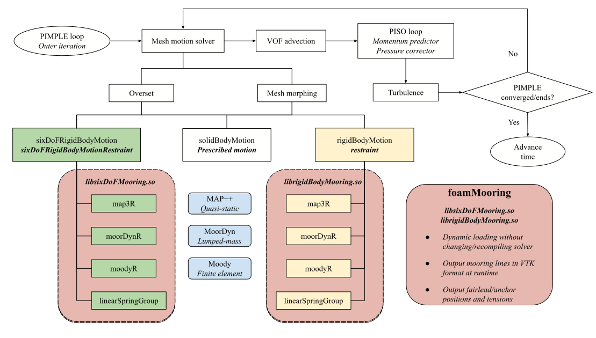
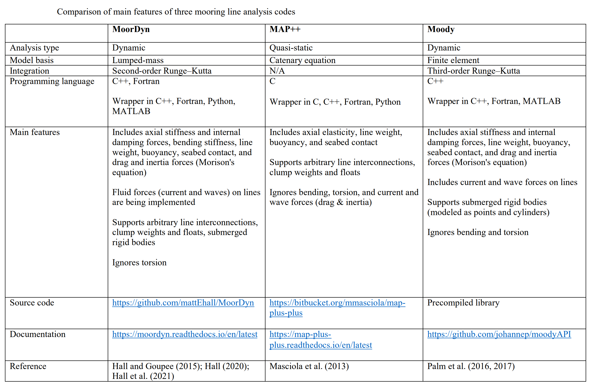

# Welcome to foamMooring

A mooring restraints library for simulating rigid body motions in OpenFOAM

---

GitLab repo: [https://gitlab.com/hfchen20/foamMooring](https://hfchen20.gitlab.io/foamMooring/)

GitHub mirror: [https://github.com/hfchen20/foamMooring](https://github.com/hfchen20/foamMooring)

Documentation: [https://hfchen20.gitlab.io/foamMooring](https://hfchen20.gitlab.io/foamMooring)

:star: Consider starring the repository if you find it useful. :star:

!!! note
    UNDER CONSTRUCTION!

---

## Overview

- Works for two rigid body motion libraries `sixDoFRigidBodyMotion` and `rigidBodyMotion`.
- Mooring models of restraints include MAP++, MoorDyn, Moody, groups of linear springs.
- Most restraints support runtime generation of legacy VTK files (including vtk.series).
- You can compile only part of the library (i.e., certain restraints) if that suits your needs.
- No need to change and re-compile the built-in motion libraries and flow solvers.
- Tested on v2012, v2212, v2306, mostly with overset grid solver `overInterDyMFoam`.
- Should also work with `interFoam` (deforming mesh) and other variants `waveFoam` and `olaFlow`.
- Even `overPimpleDyMFoam` ...

## Code structure

Three mooring analysis codes, a quasi-static mooring model MAP++ (Masciola et al., 2013), a lumped-mass mooring model MoorDyn (Hall and Goupee, 2015), and a finite element model Moody (Palm et al., 2017), are coupled with OpenFOAM’s two rigid body motion solvers by developing three corresponding rigid body motion restraints.

- Both MAP++ and MoorDyn are open-source, with the latter under continuous developments. 
- Moody is an in-house code but a precompiled library is released for coupling with other codes.
- A rewrite of `linearSpring`, `linearSpringGroup` simplifies definition of a group of identical springs and enables runtime generation of tension & VTK files.

Mooring Model | sixDoFMooring | rigidBodyMooring
:------------ |:-------------:|:-----------:
MAP++         | map3R        | map3R 
MoorDyn v1    | moorDynR1    | moorDynR1
MoorDyn v2    | moorDynR2    | moorDynR2
Moody         | moodyR       | moodyR
Linear spring | linearSpringGroup  | linearSpringGroup
Quasi-static  | waves2FoamMooring  | NA

!!! note
    `waves2FoamMooring` is available, which should be compatible with most recent versions of OpenFOAM.

    Extending on `mooringLine` in [waves2Foam](https://github.com/ogoe/waves2Foam/tree/master/src/waves2FoamMooring/mooringLine), this restraint enables definition of multiple (inhomogeneous) mooring lines and runtime generation of VTK files for visualization.

## Main features of MAP++, MoorDyn, Moody

The Mooring Analysis Program (MAP++) is an open-source project developed by the National Renewable Energy Laboratory (NREL). The multisegmented, quasi-static mooring model was developed based on an extension of conventional single line catenary solutions, allowing multielement mooring systems with arbitrary connection configurations to be analyzed. 

MoorDyn is a lumped-mass mooring analysis library. Each mooring line is discretized into a number of equal-length segments, each segment connecting two neighboring nodes. All the line mass and external forces acting on the line, including buoyancy, seabed contact force, and hydrodynamic drag and inertia forces based on Morison’s equation, are lumped at a finite number of nodes. Massless springs are conceived to connect the adjacent nodes representing the internal tension and damping forces. 

Moody is a finite element mooring dynamics model developed with the special intent of capturing and resolving snap loads. It uses an hp-adaptive discontinuous Galerkin method; the high-order formulation makes engineering accuracy achievable using only a few high order elements. Unlike the lumped-mass formulation, this model is derived first and foremost from the governing equations of motion for an elastic cable.

!!! note
    Both MoorDyn v2 and Moody now seem to support bending stiffness formulations.

## Citations
- Chen, H., & Hall, M. (2022). CFD simulation of floating body motion with mooring dynamics: Coupling MoorDyn with OpenFOAM,
Applied Ocean Research, 124, 103210. [https://doi.org/10.1016/j.apor.2022.103210](https://www.sciencedirect.com/science/article/pii/S0141118722001511)
- Chen, H., Medina, T. A., & Cercos-Pita, J. L. (2024). CFD simulation of multiple moored floating structures using OpenFOAM: An open-access mooring restraints library. Ocean Engineering, 303, 117697. [https://doi.org/10.1016/j.oceaneng.2024.117697](https://doi.org/10.1016/j.oceaneng.2024.117697) ([preprint](http://dx.doi.org/10.13140/RG.2.2.34206.10569))

## Disclaimer

This offering is not approved or endorsed by OpenCFD Limited, producer and distributor of the OpenFOAM software via www.openfoam.com, and owner of the OPENFOAM® and OpenCFD® trade marks. This offering is not approved or endorsed by any software packages mentioned above or their respective owners, and should not be considered as such.

OpenFOAM is a free, open source CFD software [released and developed by OpenCFD Ltd since 2004](http://www.openfoam.com/history/).
It has a large user base across most areas of engineering and science, from both commercial and academic organisations. [See documentation](http://www.openfoam.com/documentation)

