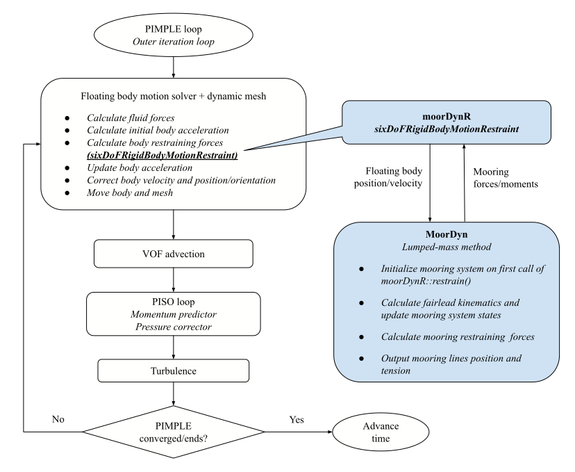

# sixDoFMooring

## Overview

The mooring restraint `libsixDoFMooring.so` enhances the native rigid body motion library `sixDoFRigidBodyMotion`, which solves the six-DoF motions for a rigid body according to Newton's second law. The restraint library can be simply loaded at runtime into the built-in OpenFOAM solvers `interFoam` and `overInterDyMFoam`, or into other variants (such as `waveFoam` and `olaFlow`) developed by the community. 

Thanks to MoorDyn’s continuous developments, more than one mooring system instance can now be created (Lozon and Hall, 2023). This makes it possible to simulate an array of individually moored floating structures using the built-in `sixDoFRigidBodyMotion` library. To enable simulation of interconnected multiple bodies, a significant rewrite of the library is deemed necessary (Eskilsson and Palm, 2022). 

## Flowchart coupling MoorDyn with OpenFOAM

- The hydrodynamic forces/moments acting on the body are first calculated, which gives an initial acceleration for each new iteration or time step. 
- All the restraining forces/moments are then requested from all instances of `sixDoFRigidBodyMotionRestraint` in order to update the body’s acceleration. 
- Once the linear and angular accelerations are obtained, the Newmark-β integration scheme is applied to update the velocity, position, and orientation of the floating body. 

<figure markdown>
  { width="800" }
  <figcaption>OpenFOAM + MoorDyn via body coupling</figcaption>
</figure>

## Coupling modes

The coupling of the mooring models with floating body motion solver follows a loose-coupling approach. Two coupling modes, i.e., body coupling and point coupling, are proposed to indicate whether the body-mooring coupling is achieved via either the body’s center of gravity (rotation) or the mooring lines’ attachments points (fairleads) on the body. 

- Body coupling

For body coupling, the position and velocity of the floating body are passed from the body motion solver to the mooring restraint, which updates the fairlead kinematics and the mooring system states such as the mooring line nodes’ position, velocity, and tension. The mooring model then calculates the total restraining forces and moments acting on the floating body by summing all mooring line contributions. The summed forces and moments are returned to the body motion solver to update the body acceleration. 

- Point coupling

For point/fairlead coupling, the mooring attachments positions (calculated from the instantaneous orientation of the floating body) are passed to the mooring models to update the mooring system states. Correspondingly, instead of the total mooring forces/moments exerting on the body, the fairlead tensions from all the mooring lines are returned from the mooring model to the rigid body restraint. The restraint then sums up the total mooring forces/moments and passes them to the motion solver to update the body motion.

## How to use sixDoFMooring
- Prepare an OpenFOAM case as usual. The floating body motion can be accommodated by either deforming mesh `interFoam` or overset grid `overInterDyMFoam`.

- Add in `controlDict`
```
libs    (sixDoFMooring); 
```
- Prepare a mooring input file in case subfolder "Mooring". For example, in `tutorial/sixDoF_2D/overset/background/Mooring/`

    MoorDyn v1: `lines.txt` (filename hard-coded)

    MoorDyn v2: `lines_v2.txt`

    Moody: `boxWu_exPoint.m`

    MAP++: `esflOWC_4lines.map`

- Define mooring restraints in `constant/dynamicMeshDict`
```
// Example mooring restraints available in libsixDoFMooring
//	moorDynR1 || moorDynR2 || map3R || moodyR 
```

=== "MAP++"

	```
	map3R
	{
		sixDoFRigidBodyMotionRestraint map3R;
		inputFile                     "Mooring/esflOWC_4lines.map";
		summaryFile                   "Mooring/esflOWC_summary.map";
		waterDepth                    0.5;
		refAttachmentPt
		(
			(-0.1      0.1    -0.077)
			(-0.1     -0.1    -0.077)
			( 0.1      0.1    -0.077)
			( 0.1     -0.1    -0.077)
		);
        
        writeMooringForces     true;
        outputFile             "Mooring/mapForces.dat";
        writeMooringVTK        true;
        //nNodes                 10;
        //nodesPerLine           (10 10 10 10);
	}
	```

=== "MoorDyn"

	```
	// MoorDyn v1
	moorDynR1
	{
		sixDoFRigidBodyMotionRestraint moorDynR1;
	}

	// MoorDyn v2
	moorDynR2_pt
	{
		sixDoFRigidBodyMotionRestraint   moorDynR2;
		inputFile          "Mooring/lines_v2_point.txt";
		couplingMode       "POINT";
		refAttachmentPt
		(
            (-0.25     0.3725   -0.16)
            (-0.25    -0.3725   -0.16)
            ( 0.25     0.3725   -0.16)
            ( 0.25    -0.3725   -0.16)
		);
		writeMooringVTK    true;
		vtkPrefix          "mdv2_pt";
		vtkStartTime       0;
		outerCorrector     3;
	}

	moorDynR2_bd
	{
		sixDoFRigidBodyMotionRestraint  moorDynR2;
		inputFile          "Mooring/lines_v2_body.txt";
		couplingMode       "BODY";
		writeMooringVTK    true;
		vtkPrefix          "mdv2_body";
		vtkStartTime       0;
		outerCorrector     3;
	}
	```

=== "Moody"

	```
	moodyR
	{
		sixDoFRigidBodyMotionRestraint moodyR;
		inputFile              "Mooring/boxWu_exPoint.m";

		couplingMode           "externalPoint"; // "externalRigidBody"
		nCouplingDof           6;
		refAttachmentPt
		(
			(-0.1      0.1    -0.077)
			(-0.1     -0.1    -0.077)
			( 0.1      0.1    -0.077)
			( 0.1     -0.1    -0.077)
		);
		waveKinematics         false;
		twoD                   true;
	}
	```

=== "waves2FoamMooring"

	```
	catenaryLine
	{            
		sixDoFRigidBodyMotionRestraint  waves2FoamMooring;
		anchor
		(
			(-0.889    0.3725    -0.6)
			(-0.889   -0.3725    -0.6)
			( 0.889    0.3725    -0.6)
			( 0.889   -0.3725    -0.6)  
		);
		refAttachmentPt
		(
			(-0.25     0.3725   -0.16)
			(-0.25    -0.3725   -0.16)
			( 0.25     0.3725   -0.16)
			( 0.25    -0.3725   -0.16)  
		);

		identicalProperties true; // default true; if false, specify a list 
								// for mass, e.g. (0.149 0.149 0.149 0.149)
								// and line length, e.g. (0.809 0.809 0.809 0.809)
		massPerLength       0.149; // Wet mass/unit length
		lineLength          0.809; // Length of the mooring line

		gravityVector       (0 0 -9.81); // Gravity vector

		writeForce          true; // optional, default false
		writeVTK            true; // optional, default false

		//nNodes              10; // optional, default 10
		//nodesPerLine        (8 6 7 9); // optional, if absent, all lines having the same
										// (nNodes);  if present, overwrite nNodes 
		//vtkPrefix           "wfoamMoor"; // optional, default restraint name
		//vtkStartTime        0; // optional, default 0
		//outerCorrector      3; // optional, default 3
	}
	```
